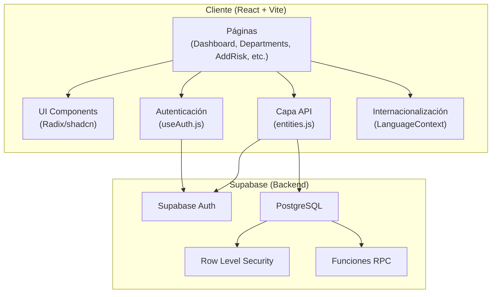
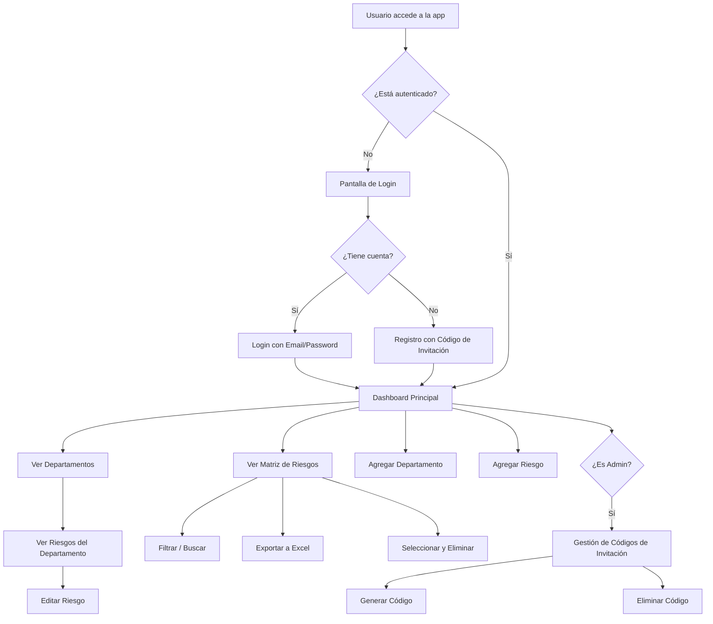

# 📋 Matriz de Riesgos — Resumen General

## Descripción del Proyecto

**Matriz de Riesgos** es una aplicación web profesional de gestión de riesgos organizacionales. Permite la identificación, evaluación, mitigación y seguimiento de riesgos por departamento, siguiendo la metodología estándar de matrices de riesgo (probabilidad × impacto).

## Propósito

El sistema está diseñado para que las organizaciones puedan:

- **Identificar** riesgos internos y externos por departamento
- **Evaluar** el riesgo inherente (antes de controles) y residual (después de mitigación)
- **Documentar** estrategias de mitigación con hasta 3 medidas por riesgo
- **Visualizar** el estado general de riesgos en un dashboard centralizado
- **Exportar** la información a Excel para reportes y auditorías
- **Controlar acceso** mediante roles (admin/user) y códigos de invitación

## Stack Tecnológico

| Componente        | Tecnología                                        |
| ----------------- | ------------------------------------------------- |
| **Frontend**      | React 18 + Vite 6                                 |
| **Estilos**       | TailwindCSS 3 + CSS personalizado (Glassmorphism) |
| **Routing**       | React Router DOM 7                                |
| **UI Components** | Radix UI + shadcn/ui                              |
| **Backend/BaaS**  | Supabase (Auth + Database + RLS + RPC)            |
| **Gráficos**      | Recharts                                          |
| **Exportación**   | xlsx + file-saver                                 |
| **Animaciones**   | Framer Motion                                     |
| **Validación**    | Zod + React Hook Form                             |
| **Deploy**        | Vercel                                            |
| **Idiomas**       | Español (ES), Inglés (EN)                         |

## Arquitectura de Alto Nivel



## Estructura de Directorios

```
tenryu-riesgos/
├── docs/                          # 📁 Documentación del proyecto
├── src/
│   ├── api/
│   │   ├── supabaseClient.js      # Configuración del cliente Supabase
│   │   ├── entities.js            # Modelos: Department, Risk, User, InvitationCode
│   │   └── integrations.js        # Integraciones de Supabase (LLM, Email, etc.)
│   ├── components/
│   │   ├── ui/                    # Componentes UI reutilizables (shadcn/ui)
│   │   ├── GlobalErrorBoundary.jsx
│   │   └── LanguageContext.jsx    # Sistema de internacionalización
│   ├── hooks/
│   │   ├── useAuth.js             # Hook de autenticación
│   │   └── use-mobile.jsx         # Detección de dispositivo móvil
│   ├── lib/
│   │   └── utils.js               # Utilidades (normalización de niveles de riesgo)
│   ├── pages/
│   │   ├── index.jsx              # Router y definición de rutas
│   │   ├── Layout.jsx             # Layout principal + Login Screen
│   │   ├── Dashboard.jsx          # Dashboard con estadísticas
│   │   ├── Departments.jsx        # Lista de departamentos
│   │   ├── AddDepartment.jsx      # Crear/Editar departamento
│   │   ├── DepartmentRisks.jsx    # Riesgos por departamento
│   │   ├── AddRisk.jsx            # Crear/Editar riesgo
│   │   ├── AllRisks.jsx           # Matriz completa de riesgos
│   │   ├── InvitationCodes.jsx    # Gestión de códigos (Admin)
│   │   ├── AddInvitationCode.jsx  # Crear código de invitación
│   │   ├── Register.jsx           # Registro con código
│   │   ├── ForgotPassword.jsx     # Recuperación de contraseña
│   │   └── UpdatePassword.jsx     # Actualización de contraseña
│   ├── utils/
│   │   └── index.ts               # Utilidad createPageUrl
│   ├── App.jsx                    # Componente raíz
│   ├── main.jsx                   # Punto de entrada
│   ├── App.css
│   └── index.css                  # Estilos globales
├── supabase-invitation-codes.sql  # Schema + funciones de invitation_codes
├── supabase-admin-rls-policies.sql# Políticas RLS para admins
├── supabase-fix-invitation-codes.sql # Fix de constraints
├── index.html
├── package.json
├── vite.config.js
├── tailwind.config.js
├── vercel.json
└── .env                           # Variables de entorno (Supabase URL/Key)
```

## Flujo General de la Aplicación



## Variables de Entorno

| Variable                 | Descripción                      |
| ------------------------ | -------------------------------- |
| `VITE_SUPABASE_URL`      | URL del proyecto Supabase        |
| `VITE_SUPABASE_ANON_KEY` | Clave pública (anon) de Supabase |

---

**Navegación de documentación:**

- [02 - Reglas de Negocio](./02-REGLAS-DE-NEGOCIO.md)
- [03 - Base de Datos](./03-BASE-DE-DATOS.md)
- [04 - Autenticación y Seguridad](./04-AUTENTICACION-Y-SEGURIDAD.md)
- [05 - Lógica del Frontend](./05-LOGICA-FRONTEND.md)
- [06 - Internacionalización](./06-INTERNACIONALIZACION.md)
- [07 - API y Entidades](./07-API-ENTIDADES.md)
- [08 - Despliegue](./08-DESPLIEGUE.md)
