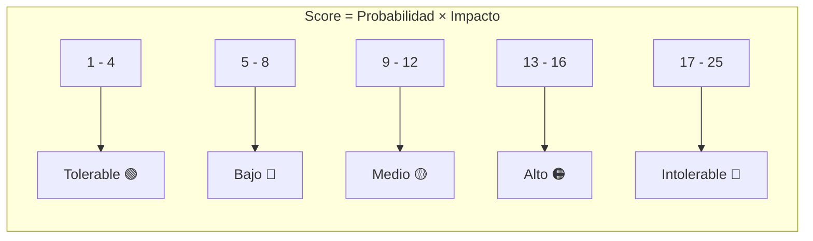
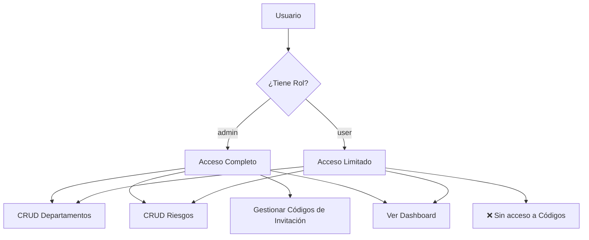

# 📐 Reglas de Negocio

## 1. Gestión de Departamentos

### Reglas

| #   | Regla         | Descripción                                                                                    |
| --- | ------------- | ---------------------------------------------------------------------------------------------- |
| D1  | Creación      | Un departamento requiere un **nombre obligatorio** y una **descripción opcional**              |
| D2  | Propiedad     | Cada departamento registra el `created_by_id` del usuario que lo creó                          |
| D3  | Edición       | Solo el nombre y la descripción son editables                                                  |
| D4  | Contador      | Cada departamento mantiene un `area_count` (inicializado en 0)                                 |
| D5  | Relación      | Un departamento puede tener **muchos riesgos** asociados (relación 1:N)                        |
| D6  | Visualización | En la lista de departamentos se muestra: nombre, descripción, total de riesgos y riesgos altos |

---

## 2. Gestión de Riesgos

### Reglas Generales

| #   | Regla               | Descripción                                                               |
| --- | ------------------- | ------------------------------------------------------------------------- |
| R1  | Campos obligatorios | `department_id`, `threat_type` y `description` son requeridos             |
| R2  | Tipo de amenaza     | Se clasifica como **Interna** o **Externa**                               |
| R3  | Propiedad           | Cada riesgo registra el `created_by_id` del usuario creador               |
| R4  | Edición             | Se puede editar cualquier campo del riesgo                                |
| R5  | Eliminación         | Se pueden eliminar riesgos individualmente o en lote (selección múltiple) |

### Evaluación de Riesgo Inherente

El riesgo inherente es la evaluación **sin considerar controles o mitigaciones**. Se calcula multiplicando la probabilidad por el impacto.

#### Escala de Probabilidad (5 niveles)

| Nivel | Etiqueta   | Valor | Rango   |
| ----- | ---------- | ----- | ------- |
| 1     | Remoto     | 1     | 0-20%   |
| 2     | Improbable | 2     | 21-40%  |
| 3     | Ocasional  | 3     | 41-60%  |
| 4     | Probable   | 4     | 61-80%  |
| 5     | Frecuente  | 5     | 81-100% |

#### Escala de Impacto (5 niveles)

| Nivel | Etiqueta       | Valor |
| ----- | -------------- | ----- |
| 1     | Insignificante | 1     |
| 2     | Menor          | 2     |
| 3     | Crítico        | 3     |
| 4     | Mayor          | 4     |
| 5     | Catastrófico   | 5     |

### Cálculo del Nivel de Riesgo

El nivel se calcula como: **Nivel = Probabilidad × Impacto**



| Rango de Score | Nivel           | Color      |
| -------------- | --------------- | ---------- |
| 1 – 4          | **Tolerable**   | 🟢 Verde   |
| 5 – 8          | **Bajo**        | 🔵 Azul    |
| 9 – 12         | **Medio**       | 🟡 Ámbar   |
| 13 – 16        | **Alto**        | 🟠 Naranja |
| 17 – 25        | **Intolerable** | 🔴 Rojo    |

### Matriz de Riesgo (Probabilidad × Impacto)

```
                    IMPACTO
              1    2    3    4    5
         ┌────┬────┬────┬────┬────┐
    5    │  5 │ 10 │ 15 │ 20 │ 25 │  Frecuente
P   4    │  4 │  8 │ 12 │ 16 │ 20 │  Probable
R   3    │  3 │  6 │  9 │ 12 │ 15 │  Ocasional
O   2    │  2 │  4 │  6 │  8 │ 10 │  Improbable
B   1    │  1 │  2 │  3 │  4 │  5 │  Remoto
         └────┴────┴────┴────┴────┘
              Ins  Men  Crí  May  Cat
```

### Estrategias de Manejo

| Estrategia     | Descripción                                                               |
| -------------- | ------------------------------------------------------------------------- |
| **Aceptar**    | Se acepta el riesgo tal cual está. No se implementan acciones adicionales |
| **Reducir**    | Se implementan medidas para disminuir la probabilidad y/o el impacto      |
| **Transferir** | Se transfiere el riesgo a un tercero (seguro, outsourcing, etc.)          |

### Medidas de Mitigación

| #   | Regla            | Descripción                                                                       |
| --- | ---------------- | --------------------------------------------------------------------------------- |
| M1  | Cantidad         | Se pueden registrar hasta **3 medidas de mitigación** por riesgo                  |
| M2  | Estructura       | Cada medida tiene una **descripción** y un **tipo de impacto**                    |
| M3  | Tipos de impacto | `Mitiga la probabilidad`, `Mitiga el impacto`, `Mitiga la probabilidad e impacto` |
| M4  | Opcionalidad     | Las medidas de mitigación son opcionales                                          |

### Evaluación de Riesgo Residual

| #   | Regla      | Descripción                                                                    |
| --- | ---------- | ------------------------------------------------------------------------------ |
| RR1 | Definición | Es la evaluación del riesgo **después** de aplicar las medidas de mitigación   |
| RR2 | Cálculo    | Se utiliza la misma fórmula y escalas que el riesgo inherente                  |
| RR3 | Manual     | El usuario debe seleccionar manualmente la probabilidad y el impacto residual  |
| RR4 | Nivel      | Se calcula automáticamente al seleccionar probabilidad e impacto               |
| RR5 | Prioridad  | El nivel residual tiene prioridad sobre el inherente en el dashboard y filtros |

---

## 3. Dashboard y Reportes

### Estadísticas del Dashboard

| Métrica                   | Cálculo                                                                |
| ------------------------- | ---------------------------------------------------------------------- |
| **Departamentos activos** | Conteo total de departamentos                                          |
| **Riesgos totales**       | Conteo total de riesgos                                                |
| **Riesgos altos**         | Riesgos con `residual_level` = Alto o Intolerable                      |
| **Riesgos bajos**         | Riesgos con nivel = Bajo o Tolerable                                   |
| **Distribución**          | Agrupación por nivel de riesgo (residual → inherente → sin clasificar) |

> **Nota:** Para el conteo de "Riesgos Altos" del dashboard, solo se usa el **nivel residual** (no el inherente). Esto refleja el riesgo real después de las mitigaciones.

### Exportación a Excel

| #   | Regla    | Descripción                                                                                                                                    |
| --- | -------- | ---------------------------------------------------------------------------------------------------------------------------------------------- |
| E1  | Formato  | Se exporta en formato `.xlsx`                                                                                                                  |
| E2  | Nombre   | `matriz_riesgos_YYYY-MM-DD.xlsx`                                                                                                               |
| E3  | Datos    | Incluye todos los riesgos filtrados con todas sus columnas                                                                                     |
| E4  | Columnas | Departamento, Tipo amenaza, Descripción, Prob/Impacto/Nivel inherente, Estrategia, Mitigantes 1-3, Prob/Impacto/Nivel residual, Fecha creación |

---

## 4. Control de Acceso



| Funcionalidad                     | Admin | User |
| --------------------------------- | ----- | ---- |
| Dashboard                         | ✅    | ✅   |
| Ver departamentos                 | ✅    | ✅   |
| Crear/Editar departamentos        | ✅    | ✅   |
| Ver/Crear/Editar/Eliminar riesgos | ✅    | ✅   |
| Exportar a Excel                  | ✅    | ✅   |
| Gestionar códigos de invitación   | ✅    | ❌   |

---

## 5. Códigos de Invitación

| #    | Regla           | Descripción                                                            |
| ---- | --------------- | ---------------------------------------------------------------------- |
| CI1  | Propósito       | Los códigos son necesarios para que nuevos usuarios puedan registrarse |
| CI2  | Formato         | Código alfanumérico de 12 caracteres formateado como `XXXX-XXXX-XXXX`  |
| CI3  | Caracteres      | Se excluyen `O`, `0`, `I`, `1` para evitar confusión visual            |
| CI4  | Unicidad        | Cada código es único en la base de datos                               |
| CI5  | Uso único       | Un código solo puede ser usado una vez                                 |
| CI6  | Expiración      | Un código puede tener fecha de expiración (opcional)                   |
| CI7  | Email vinculado | Un código puede vincularse a un email específico (opcional)            |
| CI8  | Validación      | Se valida: existencia, no usado, no expirado, email coincidente        |
| CI9  | Creación        | Solo administradores pueden crear y gestionar códigos                  |
| CI10 | Notas           | Se pueden agregar notas al código (ej: "Cliente pagó plan mensual")    |

---

**Navegación:**
← [01 - Resumen General](./01-RESUMEN-GENERAL.md) | [03 - Base de Datos](./03-BASE-DE-DATOS.md) →
