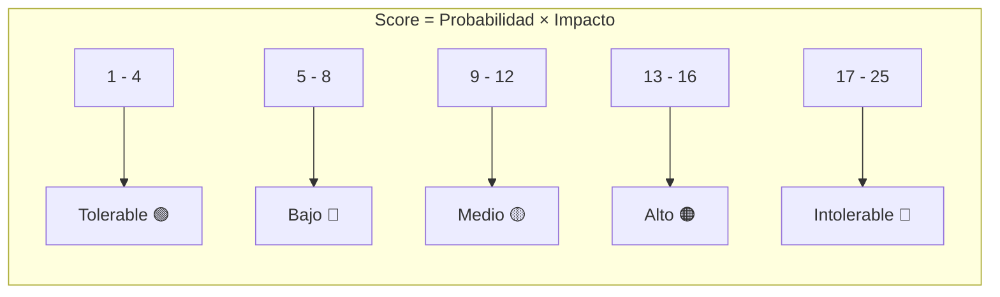
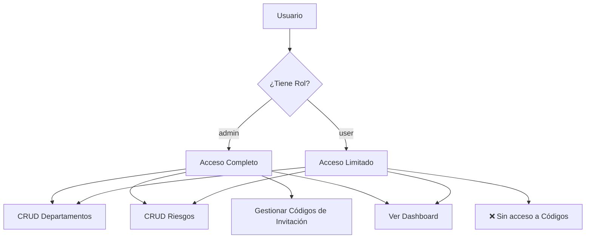

# 📐 Reglas de Negocio

## 1. Gestión de Departamentos

### Reglas

| #   | Regla         | Descripción                                                                                    |
| --- | ------------- | ---------------------------------------------------------------------------------------------- |
| D1  | Creación      | Un departamento requiere un **nombre obligatorio** y una **descripción opcional**              |
| D2  | Propiedad     | Cada departamento registra el `created_by_id` del usuario que lo creó                          |
| D3  | Edición       | Solo el nombre y la descripción son editables                                                  |
| D4  | Contador      | Cada departamento mantiene un `area_count` (inicializado en 0)                                 |
| D5  | Relación      | Un departamento puede tener **muchos riesgos** asociados (relación 1:N)                        |
| D6  | Visualización | En la lista de departamentos se muestra: nombre, descripción, total de riesgos y riesgos altos |

---

## 2. Gestión de Riesgos

### Reglas Generales

| #   | Regla               | Descripción                                                               |
| --- | ------------------- | ------------------------------------------------------------------------- |
| R1  | Campos obligatorios | `department_id`, `threat_type` y `description` son requeridos             |
| R2  | Tipo de amenaza     | Se clasifica como **Interna** o **Externa**                               |
| R3  | Propiedad           | Cada riesgo registra el `created_by_id` del usuario creador               |
| R4  | Edición             | Se puede editar cualquier campo del riesgo                                |
| R5  | Eliminación         | Se pueden eliminar riesgos individualmente o en lote (selección múltiple) |

> **Fase 1 (Perspectivas):** R1 cambia para riesgos nuevos: la **perspectiva** (`perspective_key`) es obligatoria y el `department_id` es opcional (`NULL` si no se elige). Al editar un riesgo existente la perspectiva es opcional (aviso, no bloqueo) y el departamento se conserva tal cual.

### Perspectivas (Fase 1)

| #   | Regla                    | Descripción                                                                                                                                                                                                                                                                                                                 |
| --- | ------------------------ | --------------------------------------------------------------------------------------------------------------------------------------------------------------------------------------------------------------------------------------------------------------------------------------------------------------------------- |
| P1  | Perspectiva de un riesgo | `risks.perspective_key` ∈ {financiera, cliente, competitiva, equipo} o `NULL` (= "Sin asignar"). Los nombres, ayudas y ejemplos salen siempre de `src/config/perspectives.js` (mismos que el Mapa estratégico).                                                                                                           |
| P2  | Banner de migración      | Visible en Dashboard, Perspectivas y Matriz de Riesgos mientras haya ≥ 1 riesgo del usuario sin perspectiva. No se puede descartar; desaparece solo cuando todos tienen perspectiva. El asistente sigue accesible desde el pie de Perspectivas.                                                                               |
| P3  | Sin puntaje              | Riesgo con `inherent_score IS NULL` (probabilidad o impacto vacíos o no reconocidos). Se muestra "Sin puntaje", nunca es crítico, va al final al ordenar por puntaje y cuenta en la tarjeta "Sin puntaje" del Dashboard. Se corrige editando el riesgo.                                                                       |
| P4  | Crítico (Fase 1)         | Puntaje inherente ≥ 13 (Alto o Intolerable). Todo contador nuevo de críticos muestra la aclaración "sin contar lo que ya haces para controlarlo". Los bloques antiguos del Dashboard siguen contando por nivel residual (unificar: Fase 2).                                                                                   |
| P5  | Aviso de planeación      | En `AddRisk`, en vivo, si el puntaje inherente es crítico se informa que el riesgo pasará a la planeación estratégica. Solo informa; en Fase 1 no se escribe nada en Planeación Estratégica.                                                                                                                                 |
| P6  | Asistente — Asignar      | Primero `Department.setPerspective(deptId, key)`, luego `Risk.assignPerspectiveByDepartment(deptId, key)` (solo riesgos del departamento con `perspective_key IS NULL`; nunca pisa una asignación manual). Si falla el segundo paso, la fila sigue pendiente con la sugerencia guardada y se puede reintentar sin efectos dobles. |
| P7  | Asistente — Deshacer     | Primero `Risk.undoPerspectiveByDepartment(deptId, key)` (quita la clave a TODOS los riesgos del departamento que estén en esa perspectiva, incluidos los asignados a mano en la misma), luego `Department.setPerspective(deptId, null)`. El estado "listo" se deriva de la BD, así que sobrevive a recargas.                      |
| P8  | Sugerencia               | `departments.perspective_key` válido, si no la heurística por nombre (`suggestPerspectiveForDepartment`). Sin sugerencia → ningún chip preseleccionado y Asignar deshabilitado ("Administración", "Dirección General", "Gerencia", "Dirección", "Gestión"). Nunca se propone "Procesos y competitividad" por defecto.           |
| P9  | Riesgos sueltos          | Sin perspectiva y sin departamento (o con un `department_id` que ya no existe para el usuario). Cuentan en el banner, se asignan uno por uno en el asistente (`Risk.setPerspective`), aparecen con el filtro "Sin asignar" y en la fila "Sin asignar" del Dashboard. Donde iría el departamento se muestra "Sin departamento".   |
| P10 | Excel                    | Conserva todas las columnas actuales en su orden y agrega "Perspectiva" (primera; "Sin asignar" si no tiene) y "Puntaje inherente" (número o "Sin puntaje").                                                                                                                                                                 |
| P11 | Privacidad               | Ninguna consulta nueva: todo pasa por `entities.js` sobre tablas con RLS solo-dueño.                                                                                                                                                                                                                                       |

### Evaluación de Riesgo Inherente

El riesgo inherente es la evaluación **sin considerar controles o mitigaciones**. Se calcula multiplicando la probabilidad por el impacto.

#### Escala de Probabilidad (5 niveles)

| Nivel | Etiqueta   | Valor | Rango   |
| ----- | ---------- | ----- | ------- |
| 1     | Remoto     | 1     | 0-20%   |
| 2     | Improbable | 2     | 21-40%  |
| 3     | Ocasional  | 3     | 41-60%  |
| 4     | Probable   | 4     | 61-80%  |
| 5     | Frecuente  | 5     | 81-100% |

#### Escala de Impacto (5 niveles)

| Nivel | Etiqueta       | Valor |
| ----- | -------------- | ----- |
| 1     | Insignificante | 1     |
| 2     | Menor          | 2     |
| 3     | Crítico        | 3     |
| 4     | Mayor          | 4     |
| 5     | Catastrófico   | 5     |

### Cálculo del Nivel de Riesgo

El nivel se calcula como: **Nivel = Probabilidad × Impacto**


```mermaid
graph LR
    subgraph "Score = Probabilidad × Impacto"
        A["1 - 4"] --> B["Tolerable 🟢"]
        C["5 - 8"] --> D["Bajo 🔵"]
        E["9 - 12"] --> F["Medio 🟡"]
        G["13 - 16"] --> H["Alto 🟠"]
        I["17 - 25"] --> J["Intolerable 🔴"]
    end
```

| Rango de Score | Nivel           | Color      |
| -------------- | --------------- | ---------- |
| 1 – 4          | **Tolerable**   | 🟢 Verde   |
| 5 – 8          | **Bajo**        | 🔵 Azul    |
| 9 – 12         | **Medio**       | 🟡 Ámbar   |
| 13 – 16        | **Alto**        | 🟠 Naranja |
| 17 – 25        | **Intolerable** | 🔴 Rojo    |

### Matriz de Riesgo (Probabilidad × Impacto)

```
                    IMPACTO
              1    2    3    4    5
         ┌────┬────┬────┬────┬────┐
    5    │  5 │ 10 │ 15 │ 20 │ 25 │  Frecuente
P   4    │  4 │  8 │ 12 │ 16 │ 20 │  Probable
R   3    │  3 │  6 │  9 │ 12 │ 15 │  Ocasional
O   2    │  2 │  4 │  6 │  8 │ 10 │  Improbable
B   1    │  1 │  2 │  3 │  4 │  5 │  Remoto
         └────┴────┴────┴────┴────┘
              Ins  Men  Crí  May  Cat
```

### Estrategias de Manejo

| Estrategia     | Descripción                                                               |
| -------------- | ------------------------------------------------------------------------- |
| **Aceptar**    | Se acepta el riesgo tal cual está. No se implementan acciones adicionales |
| **Reducir**    | Se implementan medidas para disminuir la probabilidad y/o el impacto      |
| **Transferir** | Se transfiere el riesgo a un tercero (seguro, outsourcing, etc.)          |

### Medidas de Mitigación

| #   | Regla            | Descripción                                                                       |
| --- | ---------------- | --------------------------------------------------------------------------------- |
| M1  | Cantidad         | Se pueden registrar hasta **3 medidas de mitigación** por riesgo                  |
| M2  | Estructura       | Cada medida tiene una **descripción** y un **tipo de impacto**                    |
| M3  | Tipos de impacto | `Mitiga la probabilidad`, `Mitiga el impacto`, `Mitiga la probabilidad e impacto` |
| M4  | Opcionalidad     | Las medidas de mitigación son opcionales                                          |

### Evaluación de Riesgo Residual

| #   | Regla      | Descripción                                                                    |
| --- | ---------- | ------------------------------------------------------------------------------ |
| RR1 | Definición | Es la evaluación del riesgo **después** de aplicar las medidas de mitigación   |
| RR2 | Cálculo    | Se utiliza la misma fórmula y escalas que el riesgo inherente                  |
| RR3 | Manual     | El usuario debe seleccionar manualmente la probabilidad y el impacto residual  |
| RR4 | Nivel      | Se calcula automáticamente al seleccionar probabilidad e impacto               |
| RR5 | Prioridad  | El nivel residual tiene prioridad sobre el inherente en el dashboard y filtros |

---

## 3. Dashboard y Reportes

### Estadísticas del Dashboard

| Métrica                   | Cálculo                                                                |
| ------------------------- | ---------------------------------------------------------------------- |
| **Departamentos activos** | Conteo total de departamentos                                          |
| **Riesgos totales**       | Conteo total de riesgos                                                |
| **Riesgos altos**         | Riesgos con `residual_level` = Alto o Intolerable                      |
| **Riesgos bajos**         | Riesgos con nivel = Bajo o Tolerable                                   |
| **Distribución**          | Agrupación por nivel de riesgo (residual → inherente → sin clasificar) |

> **Nota:** Para el conteo de "Riesgos Altos" del dashboard, solo se usa el **nivel residual** (no el inherente). Esto refleja el riesgo real después de las mitigaciones.

### Exportación a Excel

| #   | Regla    | Descripción                                                                                                                                    |
| --- | -------- | ---------------------------------------------------------------------------------------------------------------------------------------------- |
| E1  | Formato  | Se exporta en formato `.xlsx`                                                                                                                  |
| E2  | Nombre   | `matriz_riesgos_YYYY-MM-DD.xlsx`                                                                                                               |
| E3  | Datos    | Incluye todos los riesgos filtrados con todas sus columnas                                                                                     |
| E4  | Columnas | Departamento, Tipo amenaza, Descripción, Prob/Impacto/Nivel inherente, Estrategia, Mitigantes 1-3, Prob/Impacto/Nivel residual, Fecha creación |
| E5  | Fase 1   | Se agregan "Perspectiva" (primera columna; "Sin asignar" si no tiene) y "Puntaje inherente" (número o "Sin puntaje"); el resto de columnas no cambia (ver regla P10)                                      |

---

## 4. Control de Acceso


```mermaid
graph TD
    A[Usuario] --> B{¿Tiene Rol?}
    B -- "admin" --> C[Acceso Completo]
    B -- "user" --> D[Acceso Limitado]

    C --> E[CRUD Departamentos]
    C --> F[CRUD Riesgos]
    C --> G[Gestionar Códigos de Invitación]
    C --> H[Ver Dashboard]

    D --> E
    D --> F
    D --> H
    D --> I[❌ Sin acceso a Códigos]
```

| Funcionalidad                     | Admin | User |
| --------------------------------- | ----- | ---- |
| Dashboard                         | ✅    | ✅   |
| Ver departamentos                 | ✅    | ✅   |
| Crear/Editar departamentos        | ✅    | ✅   |
| Ver/Crear/Editar/Eliminar riesgos | ✅    | ✅   |
| Exportar a Excel                  | ✅    | ✅   |
| Gestionar códigos de invitación   | ✅    | ❌   |

---

## 5. Códigos de Invitación

| #    | Regla           | Descripción                                                            |
| ---- | --------------- | ---------------------------------------------------------------------- |
| CI1  | Propósito       | Los códigos son necesarios para que nuevos usuarios puedan registrarse |
| CI2  | Formato         | Código alfanumérico de 12 caracteres formateado como `XXXX-XXXX-XXXX`  |
| CI3  | Caracteres      | Se excluyen `O`, `0`, `I`, `1` para evitar confusión visual            |
| CI4  | Unicidad        | Cada código es único en la base de datos                               |
| CI5  | Uso único       | Un código solo puede ser usado una vez                                 |
| CI6  | Expiración      | Un código puede tener fecha de expiración (opcional)                   |
| CI7  | Email vinculado | Un código puede vincularse a un email específico (opcional)            |
| CI8  | Validación      | Se valida: existencia, no usado, no expirado, email coincidente        |
| CI9  | Creación        | Solo administradores pueden crear y gestionar códigos                  |
| CI10 | Notas           | Se pueden agregar notas al código (ej: "Cliente pagó plan mensual")    |

---

**Navegación:**
← [01 - Resumen General](./01-RESUMEN-GENERAL.md) | [03 - Base de Datos](./03-BASE-DE-DATOS.md) →
