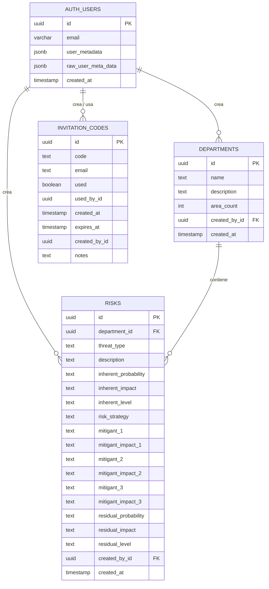
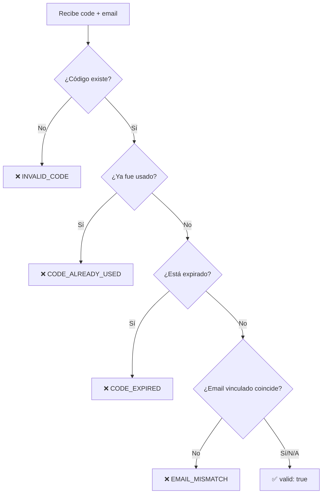

# 🗃️ Base de Datos

## Proveedor

La aplicación utiliza **Supabase** como Backend-as-a-Service (BaaS), que provee una base de datos **PostgreSQL** gestionada con las siguientes características:

- **Row Level Security (RLS)** para control de acceso a nivel de fila
- **Funciones RPC** (Remote Procedure Calls) para lógica del lado del servidor
- **Supabase Auth** integrado para autenticación de usuarios

---

## Diagrama Entidad-Relación



---

## Tablas

### 1. `departments`

Almacena los departamentos de la organización.

| Columna         | Tipo          | Restricciones     | Descripción              |
| --------------- | ------------- | ----------------- | ------------------------ |
| `id`            | `UUID`        | PK, auto-generado | Identificador único      |
| `name`          | `TEXT`        | NOT NULL          | Nombre del departamento  |
| `description`   | `TEXT`        | nullable          | Descripción de funciones |
| `area_count`    | `INTEGER`     | DEFAULT 0         | Contador de áreas        |
| `created_by_id` | `UUID`        | FK → auth.users   | ID del creador           |
| `created_at`    | `TIMESTAMPTZ` | DEFAULT NOW()     | Fecha de creación        |

### 2. `risks`

Almacena los riesgos evaluados por departamento.

| Columna                | Tipo          | Restricciones     | Descripción                                            |
| ---------------------- | ------------- | ----------------- | ------------------------------------------------------ |
| `id`                   | `UUID`        | PK, auto-generado | Identificador único                                    |
| `department_id`        | `UUID`        | FK → departments  | Departamento asociado                                  |
| `threat_type`          | `TEXT`        | —                 | `"Interna"` o `"Externa"`                              |
| `description`          | `TEXT`        | —                 | Descripción del riesgo                                 |
| `inherent_probability` | `TEXT`        | —                 | Probabilidad inherente (escala de 5 niveles)           |
| `inherent_impact`      | `TEXT`        | —                 | Impacto inherente (escala de 5 niveles)                |
| `inherent_level`       | `TEXT`        | —                 | Nivel calculado: Tolerable/Bajo/Medio/Alto/Intolerable |
| `risk_strategy`        | `TEXT`        | —                 | Estrategia: Aceptar/Reducir/Transferir                 |
| `mitigant_1`           | `TEXT`        | —                 | Descripción mitigante 1                                |
| `mitigant_impact_1`    | `TEXT`        | —                 | Tipo de mitigación 1                                   |
| `mitigant_2`           | `TEXT`        | —                 | Descripción mitigante 2                                |
| `mitigant_impact_2`    | `TEXT`        | —                 | Tipo de mitigación 2                                   |
| `mitigant_3`           | `TEXT`        | —                 | Descripción mitigante 3                                |
| `mitigant_impact_3`    | `TEXT`        | —                 | Tipo de mitigación 3                                   |
| `residual_probability` | `TEXT`        | —                 | Probabilidad residual                                  |
| `residual_impact`      | `TEXT`        | —                 | Impacto residual                                       |
| `residual_level`       | `TEXT`        | —                 | Nivel residual calculado                               |
| `created_by_id`        | `UUID`        | —                 | ID del usuario creador                                 |
| `created_at`           | `TIMESTAMPTZ` | DEFAULT NOW()     | Fecha de creación                                      |

### 3. `invitation_codes`

Almacena los códigos de invitación para registro de usuarios.

| Columna         | Tipo          | Restricciones           | Descripción                                |
| --------------- | ------------- | ----------------------- | ------------------------------------------ |
| `id`            | `UUID`        | PK, `gen_random_uuid()` | Identificador único                        |
| `code`          | `TEXT`        | NOT NULL, UNIQUE        | Código alfanumérico (ej: `ABCD-EFGH-JKLM`) |
| `email`         | `TEXT`        | nullable                | Email vinculado (opcional)                 |
| `used`          | `BOOLEAN`     | DEFAULT FALSE           | Si el código fue utilizado                 |
| `used_by_id`    | `UUID`        | nullable                | ID del usuario que usó el código           |
| `created_at`    | `TIMESTAMPTZ` | DEFAULT NOW()           | Fecha de creación                          |
| `expires_at`    | `TIMESTAMPTZ` | nullable                | Fecha de expiración (opcional)             |
| `created_by_id` | `UUID`        | nullable                | ID del admin que creó el código            |
| `notes`         | `TEXT`        | nullable                | Notas sobre el cliente/pago                |

> **Nota:** Los campos `used_by_id` y `created_by_id` en `invitation_codes` **no** tienen foreign key constraints hacia `auth.users` para evitar problemas de timing durante el registro.

#### Índices

```sql
CREATE INDEX idx_invitation_codes_code ON invitation_codes(code);
CREATE INDEX idx_invitation_codes_used ON invitation_codes(used);
CREATE INDEX idx_invitation_codes_email ON invitation_codes(email);
CREATE INDEX idx_invitation_codes_used_by_id ON invitation_codes(used_by_id);
```

---

## Funciones RPC (Stored Procedures)

### `validate_and_use_invitation_code`

Valida un código de invitación antes del registro.

```sql
validate_and_use_invitation_code(
    code_to_validate TEXT,
    user_email TEXT DEFAULT NULL
) RETURNS JSONB
```

**Flujo de validación:**



**Respuestas posibles:**

| Caso              | `valid` | `error`             | `message`                                      |
| ----------------- | ------- | ------------------- | ---------------------------------------------- |
| No existe         | `false` | `INVALID_CODE`      | "El código de invitación no existe"            |
| Ya usado          | `false` | `CODE_ALREADY_USED` | "Este código ya fue utilizado"                 |
| Expirado          | `false` | `CODE_EXPIRED`      | "Este código ha expirado"                      |
| Email no coincide | `false` | `EMAIL_MISMATCH`    | "Este código está reservado para otro usuario" |
| Válido            | `true`  | —                   | "Código válido"                                |

### `mark_invitation_code_used`

Marca un código como usado después del registro exitoso.

```sql
mark_invitation_code_used(
    code_to_mark TEXT,
    user_id UUID
) RETURNS BOOLEAN
```

Actualiza `used = true` y `used_by_id = user_id` donde el código coincida y no haya sido usado.

### `generate_random_code`

Genera un código aleatorio para invitaciones.

```sql
generate_random_code(length INT DEFAULT 12) RETURNS TEXT
```

- **Caracteres válidos:** `ABCDEFGHJKLMNPQRSTUVWXYZ23456789` (sin O, 0, I, 1)
- **Formato de salida:** `XXXX-XXXX-XXXX` (para longitud 12)

---

## Row Level Security (RLS)

### Tabla `invitation_codes`

La tabla tiene RLS habilitado con las siguientes políticas:

| Política                       | Operación | Rol             | Condición                                 |
| ------------------------------ | --------- | --------------- | ----------------------------------------- |
| Solo admins leen códigos       | `SELECT`  | `authenticated` | `user_metadata.role = 'admin'`            |
| Solo admins crean códigos      | `INSERT`  | `authenticated` | `user_metadata.role = 'admin'`            |
| Solo admins actualizan códigos | `UPDATE`  | `authenticated` | `user_metadata.role = 'admin'`            |
| Solo admins eliminan códigos   | `DELETE`  | `authenticated` | `user_metadata.role = 'admin'`            |
| Validación para registro       | `SELECT`  | `anon`          | `true` (permite validar durante registro) |

> **Importante:** La verificación del rol admin se hace en dos campos: `auth.jwt() -> 'user_metadata' ->> 'role'` **OR** `auth.jwt() -> 'raw_user_meta_data' ->> 'role'`

### Tablas `departments` y `risks`

Estas tablas usan las políticas por defecto de Supabase para usuarios autenticados (acceso completo para lectura, escritura, actualización y eliminación).

---

## Scripts SQL del Proyecto

| Archivo                             | Propósito                                                                       |
| ----------------------------------- | ------------------------------------------------------------------------------- |
| `supabase-invitation-codes.sql`     | Crear tabla `invitation_codes`, índices, políticas RLS iniciales, funciones RPC |
| `supabase-admin-rls-policies.sql`   | Actualizar políticas RLS para restringir acceso solo a admins                   |
| `supabase-fix-invitation-codes.sql` | Eliminar foreign key constraints problemáticos                                  |

---

**Navegación:**
← [02 - Reglas de Negocio](./02-REGLAS-DE-NEGOCIO.md) | [04 - Autenticación y Seguridad](./04-AUTENTICACION-Y-SEGURIDAD.md) →
