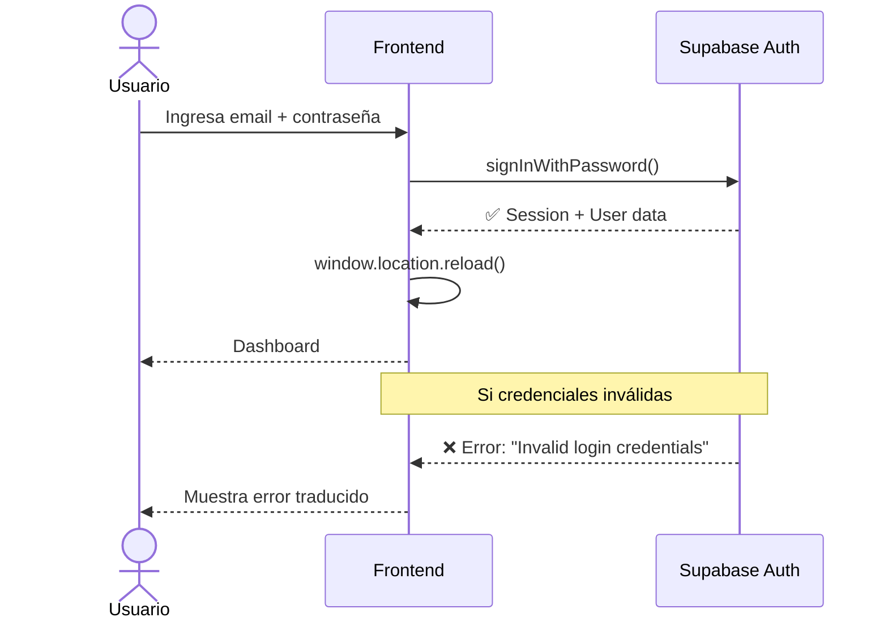
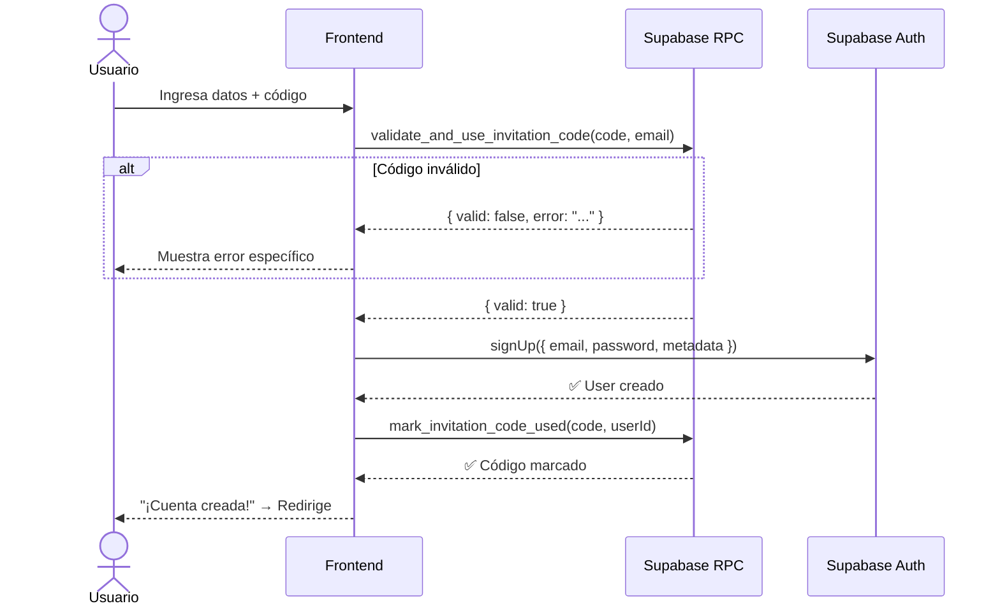
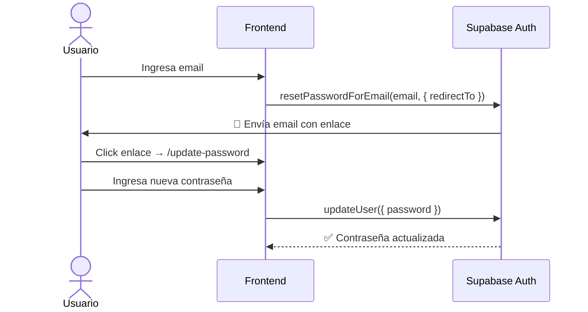
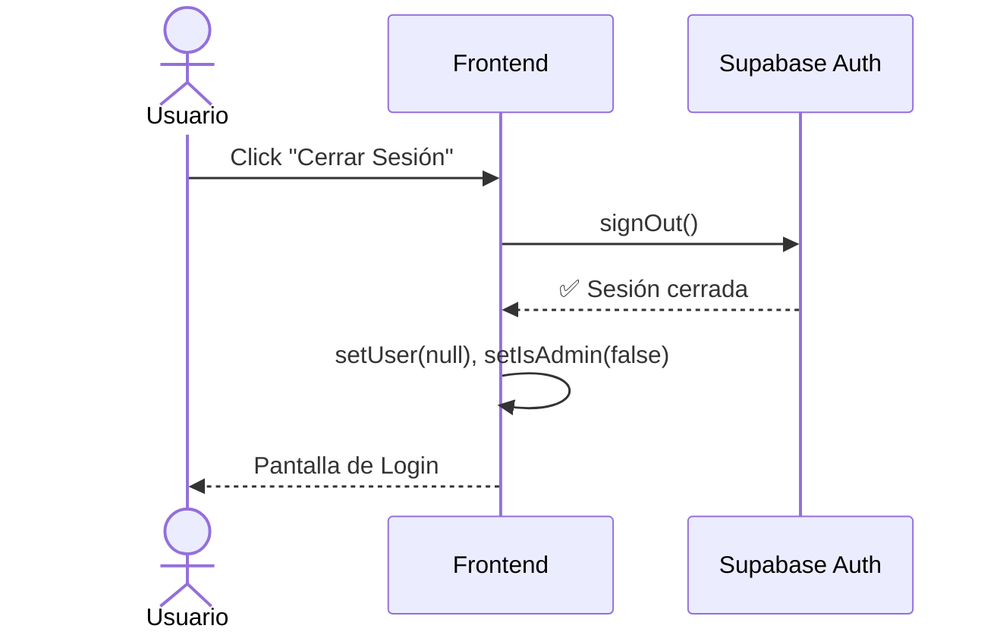
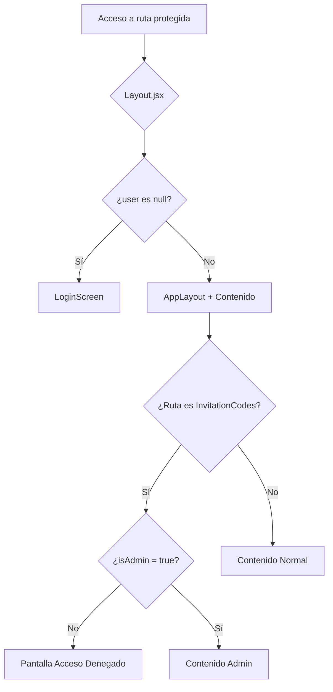

# 🔐 Autenticación y Seguridad

## Proveedor de Autenticación

La autenticación se gestiona a través de **Supabase Auth**, que proporciona:

- Autenticación por **email + contraseña**
- Gestión de sesiones con **JWT tokens**
- Recuperación de contraseña por email
- Metadata de usuario (`user_metadata`, `raw_user_meta_data`)

---

## Flujos de Autenticación

### 1. Login



### 2. Registro con Código de Invitación



**Metadata del usuario al registrarse:**

```javascript
options: {
    data: {
        full_name: fullName,
        role: 'user'  // Rol por defecto
    }
}
```

### 3. Recuperación de Contraseña



**URL de redirección:** `window.location.origin + '/update-password'`

### 4. Logout



---

## Sistema de Roles

### Roles Disponibles

| Rol     | Descripción                                                  |
| ------- | ------------------------------------------------------------ |
| `admin` | Acceso completo, incluyendo gestión de códigos de invitación |
| `user`  | Acceso estándar a departamentos, riesgos y dashboard         |

### ¿Dónde se almacena el rol?

El rol se almacena en la **metadata del usuario** de Supabase Auth:

```javascript
// Verificación del rol (orden de prioridad)
const role =
  currentUser?.user_metadata?.role ||
  currentUser?.raw_user_meta_data?.role ||
  "user"; // fallback

setIsAdmin(role === "admin");
```

> **Nota:** Se verifica tanto `user_metadata` como `raw_user_meta_data` porque Supabase puede almacenar esta información en diferentes ubicaciones según el flujo de autenticación.

### ¿Cómo cambiar un usuario a Admin?

Se debe actualizar directamente en la base de datos de Supabase. En el SQL Editor:

```sql
UPDATE auth.users
SET raw_user_meta_data = raw_user_meta_data || '{"role": "admin"}'::jsonb
WHERE email = 'admin@ejemplo.com';
```

---

## Protección de Rutas

### Rutas Públicas (sin autenticación)

| Ruta               | Componente       | Descripción                 |
| ------------------ | ---------------- | --------------------------- |
| `/register`        | `Register`       | Formulario de registro      |
| `/forgot-password` | `ForgotPassword` | Recuperación de contraseña  |
| `/update-password` | `UpdatePassword` | Actualización de contraseña |

### Rutas Protegidas (requieren autenticación)

| Ruta                 | Componente          | Admin requerido |
| -------------------- | ------------------- | --------------- |
| `/`                  | `Dashboard`         | No              |
| `/Dashboard`         | `Dashboard`         | No              |
| `/Departments`       | `Departments`       | No              |
| `/AddDepartment`     | `AddDepartment`     | No              |
| `/AddRisk`           | `AddRisk`           | No              |
| `/DepartmentRisks`   | `DepartmentRisks`   | No              |
| `/AllRisks`          | `AllRisks`          | No              |
| `/InvitationCodes`   | `InvitationCodes`   | **Sí**          |
| `/AddInvitationCode` | `AddInvitationCode` | **Sí**          |

### Mecanismo de Protección

La protección se implementa en `Layout.jsx`:

1. **Sin usuario autenticado** → Se muestra `LoginScreen` en lugar del contenido
2. **Con usuario autenticado** → Se muestra `AppLayout` con sidebar y contenido
3. **Verificación admin** → `InvitationCodes` verifica internamente si el usuario es admin y muestra "Acceso Denegado" si no lo es



---

## Listener de Estado de Autenticación

El `Layout.jsx` mantiene un listener activo que detecta cambios en el estado de la sesión:

```javascript
const { data: authListener } = supabase.auth.onAuthStateChange(
  (event, session) => {
    if (event === "SIGNED_OUT" || (event === "TOKEN_REFRESHED" && !session)) {
      setUser(null); // Sesión expirada o cerrada
      setIsAdmin(false);
    } else if (event === "SIGNED_IN" && session) {
      loadUser(); // Nueva sesión
    } else if (!session) {
      setUser(null); // Sin sesión
      setIsAdmin(false);
    }
  },
);
```

Esto asegura que la aplicación reaccione automáticamente cuando:

- La sesión expira
- El usuario cierra sesión en otra pestaña
- El token se refresca exitosamente o falla

---

## Seguridad a Nivel de Base de Datos

Además de la protección en el frontend, la base de datos tiene **Row Level Security (RLS)** en la tabla `invitation_codes`, lo que garantiza que:

- Solo usuarios con rol `admin` pueden leer, crear, actualizar o eliminar códigos
- Usuarios anónimos pueden validar códigos durante el registro (a través de la función RPC `validate_and_use_invitation_code` con `SECURITY DEFINER`)

> Ver detalles completos de RLS en [03 - Base de Datos](./03-BASE-DE-DATOS.md)

---

**Navegación:**
← [03 - Base de Datos](./03-BASE-DE-DATOS.md) | [05 - Lógica del Frontend](./05-LOGICA-FRONTEND.md) →
