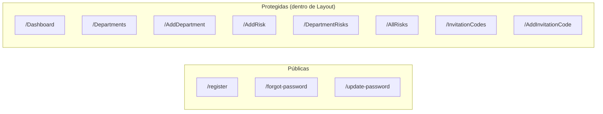
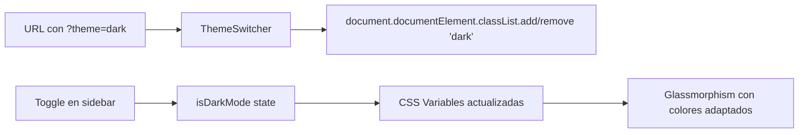

# ⚛️ Lógica del Frontend

## Estructura de Páginas

La aplicación sigue un patrón SPA (Single Page Application) con React Router para la navegación.



---

## Componentes Principales

### `Layout.jsx` — Layout Principal

**Responsabilidades:**

- Gestión del estado de autenticación (login/logout)
- Renderizado condicional: `LoginScreen` vs `AppLayout`
- Sidebar con navegación, perfil de usuario, tema y lenguaje
- Responsive: sidebar colapsable en móvil
- CSS Variables dinámicas para temas (light/dark)

**Estado interno:**

| Estado          | Tipo        | Propósito                          |
| --------------- | ----------- | ---------------------------------- |
| `user`          | Object/null | Datos del usuario autenticado      |
| `isAdmin`       | Boolean     | Si el usuario tiene rol admin      |
| `loading`       | Boolean     | Estado de carga de autenticación   |
| `loginEmail`    | String      | Email del formulario de login      |
| `loginPassword` | String      | Contraseña del formulario de login |
| `loginError`    | String      | Mensaje de error de login          |
| `sidebarOpen`   | Boolean     | Estado del sidebar en móvil        |
| `isDarkMode`    | Boolean     | Tema oscuro activo                 |

**CSS Variables de Tema:**

```css
/* Modo Claro */
--glass-bg: rgba(255, 255, 255, 0.85) --glass-border: rgba(200, 200, 220, 0.4)
  --text-primary: #1e293b --text-muted: #64748b --accent: #7c3aed
  /* Modo Oscuro */ --glass-bg: rgba(30, 30, 60, 0.6)
  --glass-border: rgba(120, 120, 200, 0.15) --text-primary: #e2e8f0
  --text-muted: #94a3b8 --accent: #a78bfa;
```

### `Dashboard.jsx` — Panel Principal

**Datos que muestra:**

| Tarjeta                | Cálculo                                                         |
| ---------------------- | --------------------------------------------------------------- |
| Departamentos activos  | `departments.length`                                            |
| Riesgos totales        | `risks.length`                                                  |
| Riesgos altos          | Filtra por `isHighRisk(r.residual_level \|\| r.inherent_level)` |
| Riesgos bajos          | Filtra por `isLowRisk(r.residual_level \|\| r.inherent_level)`  |
| Distribución por nivel | Agrupa riesgos en 5 categorías + "Sin clasificar"               |

**Flujo de datos:**

```mermaid
sequenceDiagram
    Dashboard->>User.me(): Obtener usuario
    Dashboard->>Department.list(): Obtener departamentos
    Dashboard->>Risk.list(): Obtener riesgos
    Dashboard->>Dashboard: Calcular estadísticas
    Dashboard->>Dashboard: Renderizar tarjetas + tabla
```

### `AddRisk.jsx` — Formulario de Riesgo

**Campos del formulario:**

| Sección          | Campo                       | Tipo                                | Requerido |
| ---------------- | --------------------------- | ----------------------------------- | --------- |
| General          | Departamento                | Select                              | ✅        |
| General          | Tipo de amenaza             | Select (Interna/Externa)            | ✅        |
| General          | Descripción                 | Textarea                            | ✅        |
| Riesgo Inherente | Probabilidad                | Select (5 niveles)                  | ❌        |
| Riesgo Inherente | Impacto                     | Select (5 niveles)                  | ❌        |
| Riesgo Inherente | Nivel                       | Calculado automático                | —         |
| Manejo           | Estrategia                  | Select (Aceptar/Reducir/Transferir) | ❌        |
| Mitigantes       | Mitigante 1-3 (descripción) | Input                               | ❌        |
| Mitigantes       | Impacto Mitigante 1-3       | Select                              | ❌        |
| Riesgo Residual  | Probabilidad                | Select (5 niveles)                  | ❌        |
| Riesgo Residual  | Impacto                     | Select (5 niveles)                  | ❌        |
| Riesgo Residual  | Nivel                       | Calculado automático                | —         |

**Lógica de cálculo de nivel:**

```javascript
const calculateRiskLevel = (probability, impact) => {
  const scores = {
    "Remoto (0-20%)": 1,
    "Improbable (21-40%)": 2,
    "Ocasional (41-60%)": 3,
    "Probable (61-80%)": 4,
    "Frecuente (81-100%)": 5,
  };
  const impactScores = {
    Insignificante: 1,
    Menor: 2,
    Crítico: 3,
    Mayor: 4,
    Catastrófico: 5,
  };

  const score = scores[probability] * impactScores[impact];

  if (score >= 17) return "Intolerable";
  if (score >= 13) return "Alto";
  if (score >= 9) return "Medio";
  if (score >= 5) return "Bajo";
  return "Tolerable";
};
```

### `AllRisks.jsx` — Matriz Completa

**Funcionalidades:**

| Funcionalidad              | Implementación                                      |
| -------------------------- | --------------------------------------------------- |
| Filtro por departamento    | `Select` con todos los departamentos                |
| Filtro por nivel de riesgo | `Select` con 5 niveles                              |
| Búsqueda por texto         | `Input` filtra por `description` (case-insensitive) |
| Selección múltiple         | `Checkbox` por fila + seleccionar todos             |
| Edición                    | Botón "Editar" cuando hay 1 seleccionado            |
| Eliminación en lote        | Botón "Eliminar" cuando hay ≥1 seleccionado         |
| Exportación Excel          | Botón que genera `.xlsx` con `xlsx + file-saver`    |

**Columnas de la tabla:**

```
Departamento | Tipo Amenaza | Descripción |
Prob. Inherente | Imp. Inherente | Nivel Inherente |
Estrategia |
Mitigante 1 | Impacto 1 | Mitigante 2 | Impacto 2 | Mitigante 3 | Impacto 3 |
Prob. Residual | Imp. Residual | Nivel Residual
```

### `Departments.jsx` — Lista de Departamentos

**Información mostrada por departamento:**

| Dato             | Fuente                                                  |
| ---------------- | ------------------------------------------------------- |
| Nombre           | `department.name`                                       |
| Descripción      | `department.description`                                |
| Total de riesgos | `risks.filter(r => r.department_id === dept.id).length` |
| Riesgos altos    | `isHighRisk(r.residual_level \|\| r.inherent_level)`    |

### `DepartmentRisks.jsx` — Riesgos por Departamento

Similar a `AllRisks.jsx` pero filtrado por un departamento específico. Recibe el ID del departamento via query parameter (`?id=...`).

---

## Utilidades (`src/lib/utils.js`)

### Normalización de Niveles de Riesgo

La aplicación soporta nombres de niveles en **español e inglés**, normalizándolos a constantes internas:

| Español        | Inglés       | Constante      |
| -------------- | ------------ | -------------- |
| Intolerable    | Intolerable  | `INTOLERABLE`  |
| Alto           | High         | `HIGH`         |
| Medio          | Medium       | `MEDIUM`       |
| Bajo           | Low          | `LOW`          |
| Tolerable      | Tolerable    | `TOLERABLE`    |
| Sin clasificar | Unclassified | `UNCLASSIFIED` |

**Funciones exportadas:**

| Función                      | Retorno   | Descripción                     |
| ---------------------------- | --------- | ------------------------------- |
| `normalizeRiskLevel(level)`  | `string`  | Convierte a constante interna   |
| `isHighRisk(level)`          | `boolean` | `true` si es HIGH o INTOLERABLE |
| `isLowRisk(level)`           | `boolean` | `true` si es LOW o TOLERABLE    |
| `getRiskLevelColorClasses()` | `object`  | Mapa de constantes → clases CSS |

### Navegación (`src/utils/index.ts`)

```typescript
export function createPageUrl(pageName: string) {
  return "/" + pageName.toLowerCase().replace(/ /g, "-");
}
```

Convierte nombres de página a URLs: `"AddRisk"` → `"/addrisk"`, `"AllRisks"` → `"/allrisks"`

---

## Hook Personalizado: `useAuth`

```javascript
const { user, loading, isAdmin } = useAuth();
```

| Propiedad | Tipo        | Descripción                                 |
| --------- | ----------- | ------------------------------------------- |
| `user`    | Object/null | Objeto del usuario autenticado              |
| `loading` | Boolean     | Si la verificación de auth está en progreso |
| `isAdmin` | Boolean     | Si el usuario tiene rol admin               |

**Implementación:** Escucha `onAuthStateChange` de Supabase y verifica `user_metadata.role`.

---

## Sistema de Temas

El tema se gestiona a través de un `ThemeSwitcher` en el router y un toggle en el sidebar:



**Clases de estilo "glass":**

| Clase           | Propósito                        |
| --------------- | -------------------------------- |
| `glass`         | Fondo semi-transparente con blur |
| `input-glass`   | Inputs con efecto glassmorphism  |
| `table-glass`   | Tablas con efecto glassmorphism  |
| `glass-sidebar` | Sidebar con efecto glassmorphism |

---

**Navegación:**
← [04 - Autenticación y Seguridad](./04-AUTENTICACION-Y-SEGURIDAD.md) | [06 - Internacionalización](./06-INTERNACIONALIZACION.md) →
