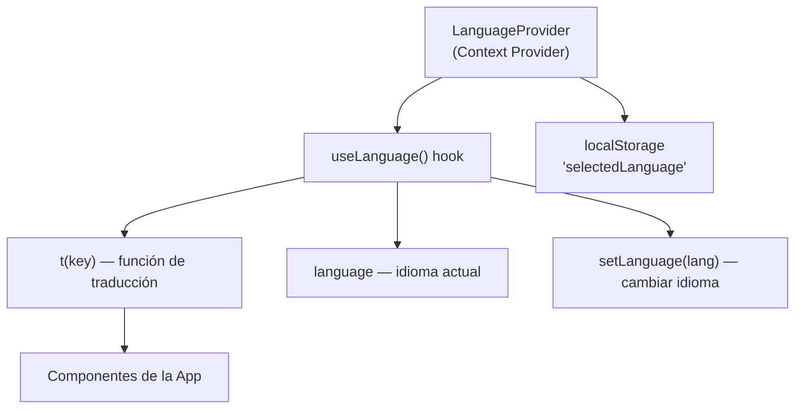

# 🌐 Internacionalización (i18n)

## Implementación

La internacionalización se gestiona mediante un **React Context** (`LanguageContext`) que provee traducciones para toda la aplicación.

### Arquitectura



### Archivo: `src/components/LanguageContext.jsx`

**Exports:**

| Export             | Tipo      | Descripción                                   |
| ------------------ | --------- | --------------------------------------------- |
| `LanguageProvider` | Component | Proveedor del contexto (envuelve la app)      |
| `useLanguage`      | Hook      | Acceso al contexto desde cualquier componente |

### Hook `useLanguage()`

| Retorno       | Tipo       | Descripción                                          |
| ------------- | ---------- | ---------------------------------------------------- |
| `language`    | `string`   | Idioma actual (`'es'` o `'en'`)                      |
| `setLanguage` | `function` | Cambiar idioma (persiste en localStorage)            |
| `t`           | `function` | Función de traducción: `t('key')` → string traducido |

---

## Idiomas Soportados

| Código | Idioma  | Estado                           |
| ------ | ------- | -------------------------------- |
| `es`   | Español | ✅ Completo (idioma por defecto) |
| `en`   | English | ✅ Completo                      |

---

## Uso en Componentes

```jsx
import { useLanguage } from "@/components/LanguageContext";

export default function MyComponent() {
  const { t, language, setLanguage } = useLanguage();

  return (
    <div>
      <h1>{t("dashboardTitle")}</h1>
      <p>{t("welcome")}</p>

      {/* Selector de idioma */}
      <select value={language} onChange={(e) => setLanguage(e.target.value)}>
        <option value="es">Español</option>
        <option value="en">English</option>
      </select>
    </div>
  );
}
```

---

## Catálogo de Traducciones

### Navegación y Layout

| Clave                | Español               | Inglés           |
| -------------------- | --------------------- | ---------------- |
| `dashboardTitle`     | Panel de Control      | Dashboard        |
| `departments`        | Departamentos         | Departments      |
| `allRisksNav`        | Riesgos               | Risks            |
| `invitationCodesNav` | Códigos de Invitación | Invitation Codes |
| `logout`             | Cerrar Sesión         | Logout           |
| `welcome`            | ¡Bienvenido!          | Welcome!         |

### Autenticación

| Clave                  | Español                       | Inglés                         |
| ---------------------- | ----------------------------- | ------------------------------ |
| `loginTitle`           | Iniciar Sesión                | Sign In                        |
| `loginSubtitle`        | Accede a tu cuenta            | Access your account            |
| `emailLabel`           | Correo electrónico            | Email address                  |
| `passwordLabel`        | Contraseña                    | Password                       |
| `loginButton`          | Entrar                        | Sign In                        |
| `registerLink`         | ¿No tienes cuenta? Regístrate | Don't have an account? Sign up |
| `forgotPasswordLink`   | ¿Olvidaste tu contraseña?     | Forgot your password?          |
| `registerTitle`        | Crear Cuenta                  | Create Account                 |
| `invitationCodeLabel`  | Código de invitación          | Invitation code                |
| `fullNameLabel`        | Nombre completo               | Full name                      |
| `confirmPasswordLabel` | Confirmar contraseña          | Confirm password               |

### Dashboard

| Clave               | Español                 | Inglés             |
| ------------------- | ----------------------- | ------------------ |
| `activeDepartments` | Departamentos Activos   | Active Departments |
| `totalRisks`        | Riesgos Totales         | Total Risks        |
| `highRisks`         | Riesgos Altos           | High Risks         |
| `lowRisks`          | Riesgos Bajos           | Low Risks          |
| `riskDistribution`  | Distribución de Riesgos | Risk Distribution  |
| `recentDepartments` | Departamentos Recientes | Recent Departments |

### Riesgos

| Clave              | Español                     | Inglés                   |
| ------------------ | --------------------------- | ------------------------ |
| `intolerable`      | Intolerable                 | Intolerable              |
| `high`             | Alto                        | High                     |
| `medium`           | Medio                       | Medium                   |
| `low`              | Bajo                        | Low                      |
| `tolerable`        | Tolerable                   | Tolerable                |
| `unclassified`     | Sin clasificar              | Unclassified             |
| `newRisk`          | Nuevo Riesgo                | New Risk                 |
| `editRisk`         | Editar Riesgo               | Edit Risk                |
| `inherentRiskEval` | Evaluación Riesgo Inherente | Inherent Risk Evaluation |
| `residualRisk`     | Riesgo Residual             | Residual Risk            |
| `threatInternal`   | Interna                     | Internal                 |
| `threatExternal`   | Externa                     | External                 |

### Probabilidades

| Clave                 | Español             | Inglés              |
| --------------------- | ------------------- | ------------------- |
| `Remoto (0-20%)`      | Remoto (0-20%)      | Remote (0-20%)      |
| `Improbable (21-40%)` | Improbable (21-40%) | Improbable (21-40%) |
| `Ocasional (41-60%)`  | Ocasional (41-60%)  | Occasional (41-60%) |
| `Probable (61-80%)`   | Probable (61-80%)   | Probable (61-80%)   |
| `Frecuente (81-100%)` | Frecuente (81-100%) | Frequent (81-100%)  |

### Impactos

| Clave            | Español        | Inglés        |
| ---------------- | -------------- | ------------- |
| `Insignificante` | Insignificante | Insignificant |
| `Menor`          | Menor          | Minor         |
| `Crítico`        | Crítico        | Critical      |
| `Mayor`          | Mayor          | Major         |
| `Catastrófico`   | Catastrófico   | Catastrophic  |

### Estrategias

| Clave                | Español    | Inglés   |
| -------------------- | ---------- | -------- |
| `strategyAceptar`    | Aceptar    | Accept   |
| `strategyReducir`    | Reducir    | Reduce   |
| `strategyTransferir` | Transferir | Transfer |

### Códigos de Invitación

| Clave                  | Español               | Inglés           |
| ---------------------- | --------------------- | ---------------- |
| `codesTitle`           | Códigos de Invitación | Invitation Codes |
| `codesCreateButton`    | Generar Código        | Generate Code    |
| `codesStatTotal`       | Total Códigos         | Total Codes      |
| `codesStatUsed`        | Utilizados            | Used             |
| `codesStatAvailable`   | Disponibles           | Available        |
| `codesStatusUsed`      | Utilizado             | Used             |
| `codesStatusExpired`   | Expirado              | Expired          |
| `codesStatusAvailable` | Disponible            | Available        |

---

## Agregar un Nuevo Idioma

Para agregar soporte a un nuevo idioma (ej: Japonés `ja`):

1. Editar `src/components/LanguageContext.jsx`
2. Agregar un nuevo bloque al objeto `translations`:

```javascript
const translations = {
  es: {
    /* ... traducciones en español ... */
  },
  en: {
    /* ... traducciones en inglés ... */
  },
  ja: {
    dashboardTitle: "ダッシュボード",
    departments: "部門",
    // ... todas las claves
  },
};
```

3. Actualizar el selector de idioma en `Layout.jsx` para incluir la nueva opción

---

## Persistencia

El idioma seleccionado se **persiste en `localStorage`** bajo la clave `'selectedLanguage'`:

- Al cargar la app, se lee el valor guardado
- Si no hay valor, se usa `'es'` (español) por defecto
- Al cambiar idioma, se guarda automáticamente

---

**Navegación:**
← [05 - Lógica del Frontend](./05-LOGICA-FRONTEND.md) | [07 - API y Entidades](./07-API-ENTIDADES.md) →
