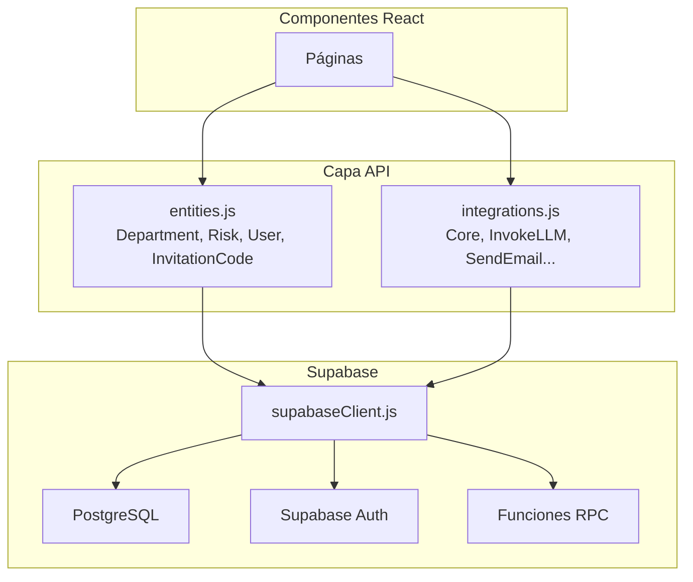

# 🔌 API y Entidades

## Arquitectura de la Capa de Datos

La capa de acceso a datos se organiza en tres archivos:

| Archivo                     | Propósito                                                |
| --------------------------- | -------------------------------------------------------- |
| `src/api/supabaseClient.js` | Inicialización del cliente Supabase                      |
| `src/api/entities.js`       | Modelos de datos: Department, Risk, User, InvitationCode |
| `src/api/integrations.js`   | Integraciones externas (LLM, Email, etc.)                |



---

## Cliente Supabase

### `src/api/supabaseClient.js`

```javascript
import { createClient } from "@supabase/supabase-js";

const supabaseUrl = import.meta.env.VITE_SUPABASE_URL;
const supabaseAnonKey = import.meta.env.VITE_SUPABASE_ANON_KEY;

export const supabase = createClient(supabaseUrl, supabaseAnonKey);
```

---

## Entidades

### `Department`

Gestión de departamentos organizacionales.

| Método   | Firma                     | Descripción                                                    |
| -------- | ------------------------- | -------------------------------------------------------------- |
| `list`   | `list(order?)`            | Lista departamentos, ordenados por `order` o `created_at` desc |
| `filter` | `filter(filters, order?)` | Filtra departamentos por objeto de condiciones                 |
| `get`    | `get(id)`                 | Obtiene un departamento por ID                                 |
| `create` | `create(data)`            | Crea un nuevo departamento                                     |
| `update` | `update(id, data)`        | Actualiza un departamento existente                            |
| `delete` | `delete(id)`              | Elimina un departamento por ID                                 |

**Ejemplo de uso:**

```javascript
import { Department } from "@/api/entities";

// Listar todos
const departments = await Department.list("-created_date");

// Filtrar
const filtered = await Department.filter({ id: "uuid-123" });

// Crear
await Department.create({ name: "Finanzas", description: "..." });

// Actualizar
await Department.update("uuid-123", { name: "Finanzas Actualizadas" });

// Eliminar
await Department.delete("uuid-123");
```

### `Risk`

Gestión de riesgos por departamento.

| Método   | Firma                     | Descripción                    |
| -------- | ------------------------- | ------------------------------ |
| `list`   | `list(order?)`            | Lista todos los riesgos        |
| `filter` | `filter(filters, order?)` | Filtra riesgos por condiciones |
| `get`    | `get(id)`                 | Obtiene un riesgo por ID       |
| `create` | `create(data)`            | Crea un nuevo riesgo           |
| `update` | `update(id, data)`        | Actualiza un riesgo existente  |
| `delete` | `delete(id)`              | Elimina un riesgo por ID       |

**Campos del objeto Risk:**

```javascript
{
    department_id: 'uuid',
    threat_type: 'Interna' | 'Externa',
    description: 'Descripción del riesgo',
    inherent_probability: 'Remoto (0-20%)' | ... ,
    inherent_impact: 'Insignificante' | ... ,
    inherent_level: 'Tolerable' | 'Bajo' | 'Medio' | 'Alto' | 'Intolerable',
    risk_strategy: 'Aceptar' | 'Reducir' | 'Transferir',
    mitigant_1: 'Descripción mitigante',
    mitigant_impact_1: 'Mitiga la probabilidad' | ... ,
    mitigant_2: '...',
    mitigant_impact_2: '...',
    mitigant_3: '...',
    mitigant_impact_3: '...',
    residual_probability: '...',
    residual_impact: '...',
    residual_level: '...',
    created_by_id: 'uuid'
}
```

### `User`

Interacción con el usuario autenticado.

| Método       | Firma                | Descripción                                                                                 |
| ------------ | -------------------- | ------------------------------------------------------------------------------------------- |
| `me`         | `me()`               | Retorna el usuario autenticado actual                                                       |
| `list`       | `list()`             | Lista todos los usuarios (solo admin). Ver [09 - Suspensión](./09-SUSPENSION-DE-CUENTAS.md) |
| `suspend`    | `suspend(userId)`    | Suspende una cuenta (solo admin). Ver [09 - Suspensión](./09-SUSPENSION-DE-CUENTAS.md)      |
| `reactivate` | `reactivate(userId)` | Reactiva una cuenta (solo admin). Ver [09 - Suspensión](./09-SUSPENSION-DE-CUENTAS.md)      |

**Retorno de `User.me()`:**

```javascript
{
    id: 'uuid',
    email: 'user@example.com',
    user_metadata: {
        full_name: 'Nombre',
        role: 'admin' | 'user'
    },
    raw_user_meta_data: {
        full_name: 'Nombre',
        role: 'admin' | 'user'
    }
}
```

### `InvitationCode`

Gestión de códigos de invitación (requiere rol admin para la mayoría de operaciones).

| Método     | Firma                    | Descripción                                       |
| ---------- | ------------------------ | ------------------------------------------------- |
| `list`     | `list(order?)`           | Lista todos los códigos                           |
| `get`      | `get(id)`                | Obtiene un código por ID                          |
| `create`   | `create(data)`           | Crea un nuevo código de invitación                |
| `delete`   | `delete(id)`             | Elimina un código                                 |
| `stats`    | `stats()`                | Retorna estadísticas (total, usados, disponibles) |
| `validate` | `validate(code, email)`  | Valida un código via RPC                          |
| `markUsed` | `markUsed(code, userId)` | Marca un código como usado via RPC                |

**Estadísticas (`InvitationCode.stats()`):**

```javascript
{
    total: 15,      // Total de códigos generados
    used: 8,        // Códigos ya utilizados
    available: 7    // Códigos disponibles
}
```

---

## Operaciones Comunes

### Patrón de ordenamiento

El parámetro `order` usa el formato:

- `"created_date"` → ascendente por fecha de creación
- `"-created_date"` → descendente (más recientes primero)

```javascript
// El prefijo "-" indica orden descendente
const risks = await Risk.list("-created_date");
```

### Patrón de filtros

```javascript
// Filtra por un campo
const deptRisks = await Risk.filter({ department_id: "uuid-123" });

// Múltiples filtros (AND)
const filtered = await Risk.filter({
  department_id: "uuid-123",
  threat_type: "Interna",
});
```

### Manejo de errores

Los métodos de las entidades lanzan excepciones en caso de error. Los componentes deben usar `try/catch`:

```javascript
try {
  await Risk.create(riskData);
  navigate("/allrisks");
} catch (error) {
  console.error("Error:", error);
  setError(t("errorCreatingRisk"));
}
```

---

## Integraciones (`src/api/integrations.js`)

Se exportan las siguientes integraciones de Supabase, que están disponibles pero **no se utilizan activamente** en el código actual:

| Integración                   | Propósito                          |
| ----------------------------- | ---------------------------------- |
| `Core`                        | Acceso directo al cliente Supabase |
| `InvokeLLM`                   | Invocación de modelos de lenguaje  |
| `SendEmail`                   | Envío de correos electrónicos      |
| `UploadFile`                  | Subida de archivos al storage      |
| `GenerateImage`               | Generación de imágenes             |
| `ExtractDataFromUploadedFile` | Extracción de datos de archivos    |
| `CreateFileSignedUrl`         | Creación de URLs firmadas          |
| `UploadPrivateFile`           | Subida de archivos privados        |

> **Nota:** Estas integraciones están disponibles como wrappers para futuras funcionalidades pero no están implementadas en la versión actual de la aplicación.

---

**Navegación:**
← [06 - Internacionalización](./06-INTERNACIONALIZACION.md) | [08 - Despliegue](./08-DESPLIEGUE.md) →
