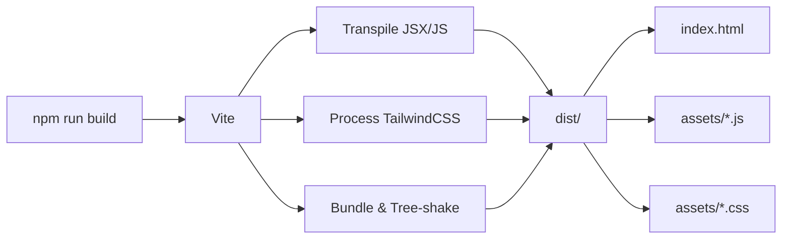
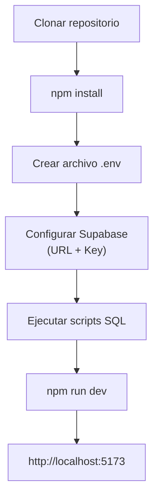

# 🚀 Despliegue

## Plataforma de Despliegue

La aplicación se despliega en **Vercel**, optimizado para aplicaciones React + Vite.

---

## Configuración de Vercel

### Archivo `vercel.json`

```json
{
  "rewrites": [{ "source": "/(.*)", "destination": "/index.html" }]
}
```

Esta configuración asegura que todas las rutas del SPA sean manejadas por `index.html`, permitiendo que React Router gestione la navegación del lado del cliente.

---

## Scripts Disponibles

| Script    | Comando           | Propósito                         |
| --------- | ----------------- | --------------------------------- |
| `dev`     | `npm run dev`     | Servidor de desarrollo (Vite)     |
| `build`   | `npm run build`   | Compilar para producción          |
| `preview` | `npm run preview` | Previsualizar build de producción |
| `lint`    | `npm run lint`    | Ejecutar ESLint                   |

---

## Proceso de Build



### Configuración de Vite (`vite.config.js`)

- **Plugin React:** `@vitejs/plugin-react`
- **Path aliases:** `@/` → `./src/` (configurado en `jsconfig.json` y `vite.config.js`)
- **Build target:** Navegadores modernos

### Configuración de Path Aliases

`jsconfig.json`:

```json
{
  "compilerOptions": {
    "baseUrl": ".",
    "paths": {
      "@/*": ["./src/*"]
    }
  }
}
```

Esto permite importar con:

```javascript
import { Risk } from "@/api/entities";
import { useLanguage } from "@/components/LanguageContext";
```

---

## Variables de Entorno para Producción

Las variables de entorno deben configurarse en el panel de Vercel:

| Variable                 | Valor                       | Descripción               |
| ------------------------ | --------------------------- | ------------------------- |
| `VITE_SUPABASE_URL`      | `https://xxxxx.supabase.co` | URL del proyecto Supabase |
| `VITE_SUPABASE_ANON_KEY` | `eyJhbGc...`                | Clave pública de Supabase |

> ⚠️ **Importante:** El prefijo `VITE_` es requerido para que Vite exponga las variables al código del cliente.

---

## Configurar Supabase para Producción

### 1. Crear proyecto en Supabase

1. Ir a [supabase.com](https://supabase.com) y crear un nuevo proyecto
2. Obtener URL y Anon Key del proyecto

### 2. Ejecutar scripts SQL

Ejecutar en el SQL Editor de Supabase en orden:

1. **`supabase-invitation-codes.sql`** — Crea tabla, funciones RPC, índices
2. **`supabase-admin-rls-policies.sql`** — Configura políticas RLS
3. **`supabase-fix-invitation-codes.sql`** — Elimina FK constraints

### 3. Crear tablas departments y risks

Crear las tablas `departments` y `risks` en el Table Editor de Supabase con los campos documentados en [03 - Base de Datos](./03-BASE-DE-DATOS.md).

### 4. Crear primer usuario admin

1. Registrarse normalmente (necesita un código de invitación inicial)
2. O crear manualmente en Supabase Dashboard → Authentication → Users
3. Actualizar metadata para asignar rol admin:

```sql
UPDATE auth.users
SET raw_user_meta_data = raw_user_meta_data || '{"role": "admin"}'::jsonb
WHERE email = 'admin@ejemplo.com';
```

### 5. Crear primer código de invitación

Si no hay códigos, se puede crear directamente en la tabla `invitation_codes`:

```sql
INSERT INTO invitation_codes (code, used, expires_at)
VALUES ('ABCD-EFGH-JKLM', false, NOW() + INTERVAL '30 days');
```

---

## Configuración SMTP (Emails)

Para que funcione la recuperación de contraseña, se debe configurar SMTP en Supabase:

1. Ir a **Settings → Auth → SMTP Settings** en Supabase Dashboard
2. Configurar con un proveedor SMTP (SendGrid, Mailgun, etc.)
3. Ver detalles completos en el archivo `CONFIGURACION_SMTP.md` del proyecto

---

## Flujo de Desarrollo Local



### Pasos:

1. `git clone <repo-url>`
2. `npm install`
3. Crear `.env` con `VITE_SUPABASE_URL` y `VITE_SUPABASE_ANON_KEY`
4. Ejecutar los 3 scripts SQL en Supabase
5. `npm run dev`

---

## Dependencias del Proyecto

### Producción

| Paquete                    | Versión | Propósito                    |
| -------------------------- | ------- | ---------------------------- |
| `react`                    | ^18     | Framework UI                 |
| `react-dom`                | ^18     | Rendering DOM                |
| `react-router-dom`         | ^7      | Routing                      |
| `@supabase/supabase-js`    | ^2      | Cliente Supabase             |
| `lucide-react`             | —       | Iconos                       |
| `@radix-ui/*`              | —       | Primitivos UI (shadcn)       |
| `tailwind-merge`           | —       | Merge clases Tailwind        |
| `class-variance-authority` | —       | Variantes de componentes     |
| `clsx`                     | —       | Concatenar clases            |
| `recharts`                 | —       | Gráficos                     |
| `xlsx`                     | —       | Generación de archivos Excel |
| `file-saver`               | —       | Descarga de archivos         |
| `framer-motion`            | —       | Animaciones                  |
| `zod`                      | —       | Validación de schemas        |
| `date-fns`                 | —       | Utilidades de fechas         |
| `sonner`                   | —       | Notificaciones toast         |

### Desarrollo

| Paquete                | Propósito              |
| ---------------------- | ---------------------- |
| `vite`                 | Build tool             |
| `@vitejs/plugin-react` | Plugin Vite para React |
| `tailwindcss`          | Framework CSS          |
| `postcss`              | Processing CSS         |
| `autoprefixer`         | Prefijos vendor CSS    |
| `eslint`               | Linting                |

---

**Navegación:**
← [07 - API y Entidades](./07-API-ENTIDADES.md) | [01 - Resumen General](./01-RESUMEN-GENERAL.md) (inicio) →
