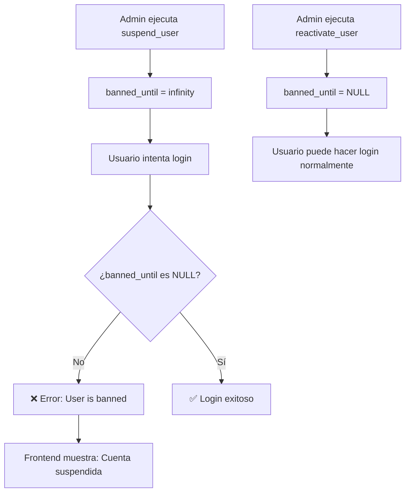

# 🚫 Suspensión de Cuentas

## Descripción

El sistema permite **suspender cuentas de usuario** sin eliminar sus datos. Un usuario suspendido no puede iniciar sesión, pero toda su información (riesgos, departamentos, etc.) se conserva intacta y puede reactivarse en cualquier momento.

Los administradores pueden gestionar las suspensiones desde:

- **Panel de Administración** → Ruta `/usermanagement` (interfaz visual)
- **API** → `User.suspend()` y `User.reactivate()`
- **SQL** → Funciones RPC o queries directos

---

## ¿Cómo Funciona?

Se utiliza el campo nativo `banned_until` de **Supabase Auth**:

- `banned_until = 'infinity'` → cuenta suspendida indefinidamente
- `banned_until = NULL` → cuenta activa

Cuando `banned_until` tiene un valor, Supabase **bloquea automáticamente** cualquier intento de login con un error `403 - User is banned`.



---

## Funciones RPC

### `suspend_user(target_user_id UUID)`

Suspende un usuario estableciendo `banned_until = 'infinity'`.

**Parámetros:**

| Parámetro        | Tipo   | Descripción                |
| ---------------- | ------ | -------------------------- |
| `target_user_id` | `UUID` | ID del usuario a suspender |

**Respuestas:**

| Caso            | `success` | `error`          | `message`                                      |
| --------------- | --------- | ---------------- | ---------------------------------------------- |
| Éxito           | `true`    | —                | "Usuario suspendido exitosamente"              |
| No es admin     | `false`   | `UNAUTHORIZED`   | "Solo los administradores pueden suspender..." |
| No encontrado   | `false`   | `USER_NOT_FOUND` | "El usuario no fue encontrado"                 |
| Auto-suspensión | `false`   | `SELF_SUSPEND`   | "No puedes suspender tu propia cuenta"         |

### `reactivate_user(target_user_id UUID)`

Reactiva un usuario estableciendo `banned_until = NULL`.

**Parámetros:**

| Parámetro        | Tipo   | Descripción                |
| ---------------- | ------ | -------------------------- |
| `target_user_id` | `UUID` | ID del usuario a reactivar |

**Respuestas:**

| Caso          | `success` | `error`          | `message`                                      |
| ------------- | --------- | ---------------- | ---------------------------------------------- |
| Éxito         | `true`    | —                | "Usuario reactivado exitosamente"              |
| No es admin   | `false`   | `UNAUTHORIZED`   | "Solo los administradores pueden reactivar..." |
| No encontrado | `false`   | `USER_NOT_FOUND` | "El usuario no fue encontrado"                 |

### `list_users()`

Retorna la lista de usuarios con su estado de suspensión. Solo para administradores.

**Respuesta exitosa:**

```json
{
  "success": true,
  "users": [
    {
      "id": "uuid",
      "email": "user@example.com",
      "full_name": "Nombre",
      "role": "user",
      "banned_until": null,
      "created_at": "2025-01-01T00:00:00Z",
      "last_sign_in_at": "2025-03-01T00:00:00Z"
    }
  ]
}
```

---

## Uso desde la API (Frontend)

```javascript
import { User } from "@/api/entities";

// Suspender un usuario
const result = await User.suspend("uuid-del-usuario");
// → { success: true, message: "Usuario suspendido exitosamente", email: "user@example.com" }

// Reactivar un usuario
const result = await User.reactivate("uuid-del-usuario");
// → { success: true, message: "Usuario reactivado exitosamente", email: "user@example.com" }
```

---

## Uso desde SQL (Manual)

### Suspender un usuario

```sql
-- Usando la función RPC (recomendado, requiere estar autenticado como admin)
SELECT suspend_user('uuid-del-usuario');

-- Directamente en SQL Editor (alternativa)
UPDATE auth.users
SET banned_until = 'infinity'
WHERE email = 'usuario@ejemplo.com';
```

### Reactivar un usuario

```sql
-- Usando la función RPC
SELECT reactivate_user('uuid-del-usuario');

-- Directamente en SQL Editor
UPDATE auth.users
SET banned_until = NULL
WHERE email = 'usuario@ejemplo.com';
```

### Verificar estado de una cuenta

```sql
SELECT
  email,
  banned_until,
  CASE
    WHEN banned_until IS NOT NULL THEN '🔴 Suspendida'
    ELSE '🟢 Activa'
  END as estado
FROM auth.users
WHERE email = 'usuario@ejemplo.com';
```

### Listar todos los usuarios suspendidos

```sql
SELECT email, banned_until, raw_user_meta_data->>'full_name' as nombre
FROM auth.users
WHERE banned_until IS NOT NULL
ORDER BY banned_until DESC;
```

---

## Experiencia del Usuario Suspendido

Cuando un usuario suspendido intenta iniciar sesión, verá el siguiente mensaje en la pantalla de login:

- **Español:** "Tu cuenta ha sido suspendida. Contacta al administrador."
- **English:** "Your account has been suspended. Please contact the administrator."

---

## Instalación

1. Ve a **Supabase Dashboard** → **SQL Editor**
2. Copia y ejecuta el archivo `supabase-suspend-user.sql`
3. Verifica que se crearon las funciones:

```sql
SELECT proname, prosecdef
FROM pg_proc
WHERE proname IN ('suspend_user', 'reactivate_user');
```

---

## Panel de Administración (UI)

Los administradores tienen acceso a una pantalla dedicada en `/usermanagement` que incluye:

- **Tarjetas de estadísticas**: Total de usuarios, activos y suspendidos
- **Búsqueda**: Filtrar usuarios por nombre o email
- **Tabla de usuarios**: Con nombre, email, rol, estado, fecha de registro y último acceso
- **Acciones**: Botón para suspender o reactivar cada usuario (con confirmación)

> **Nota:** El admin no puede suspender su propia cuenta. Se muestra "(Tú)" junto a su registro.

### Ruta Protegida

| Ruta              | Componente       | Admin requerido |
| ----------------- | ---------------- | --------------- |
| `/usermanagement` | `UserManagement` | **Sí**          |

El item "Gestión de Usuarios" aparece en el menú lateral solo para administradores.

---

## Seguridad

- Ambas funciones usan `SECURITY DEFINER`, lo que permite acceder a `auth.users` de forma segura
- La verificación de rol admin se hace dentro de la función SQL (no solo en el frontend)
- Un admin **no puede suspender su propia cuenta** (protección contra auto-bloqueo)
- Los datos del usuario (riesgos, departamentos, etc.) **NO se eliminan** al suspender

---

## Scripts SQL Relacionados

| Archivo                     | Propósito                                            |
| --------------------------- | ---------------------------------------------------- |
| `supabase-suspend-user.sql` | Crear funciones RPC para suspender/reactivar cuentas |

---

**Navegación:**
← [08 - Despliegue](./08-DESPLIEGUE.md)
